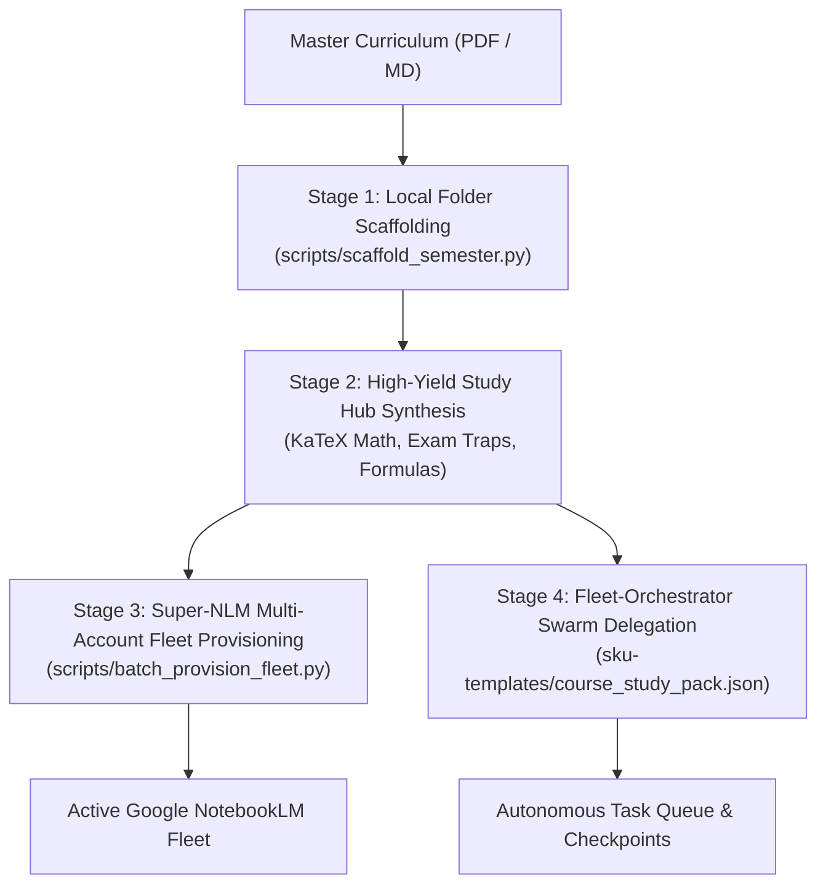

# Academic Notebook Architect Skill

This skill provides an end-to-end procedural workflow for scaffolding academic semester note repositories, extracting modular per-subject syllabi, generating formula-dense high-yield study hubs with exam traps, provisioning Google NotebookLM notebooks across a multi-account fleet (Super-NLM), and delegating heavy extraction workloads to autonomous swarms (Fleet-Orchestrator).

---

## 1. Architectural Overview & Scaffolding Invariants

An effective academic knowledge repository must maintain clear separation between raw lecture materials, official syllabi, past examination papers, and synthesized study hubs.

```
<Semester Root>/ (e.g., [IV-II]/)
├── <Core Subject 1>/
│   ├── <Subject>_Syllabus.md          # Extracted syllabus units and references
│   ├── StudyHub.md                    # High-yield KaTeX formulas and exam traps
│   ├── Notes by <Faculty> Sir/        # Faculty-specific lecture slides and notes
│   ├── Slides/                        # Presentation decks
│   └── Chapterwise/                   # Granular chapter files
├── Past Qns/                          # Centralized past questions hub
│   ├── Past_Questions_Index.md        # Unified index across all courses
│   └── <Year>.<Part><program>_<subject>_<type>.pdf
├── Elective <Tier>/                   # Modular, zero-lock-in elective catalogs
│   ├── _Elective_<Tier>_Options_Catalog.md
│   ├── <Candidate Elective 1>/Syllabus.md
│   └── <Candidate Elective 2>/Syllabus.md (Preserves existing files if active)
└── Project (Part B)/
    └── Project_Guidelines.md
```

### The Invariants
1. **Never Overwrite or Flatten Existing Assets**: If a folder already contains instructor notes or slides (e.g. 130 files in a candidate elective), preserve every file intact. Place new `Syllabus.md` or `StudyHub.md` alongside existing resources.
2. **Undecided Electives Agnosticism**: When electives are not finalized, do **not** force a single selection. Proactively scaffold placeholder directories with extracted syllabi for **all curriculum elective options** (e.g. 8 for Elective II, 8 for Elective III) and create `_Elective_Options_Catalog.md`.
3. **Dual-Mirroring of Study Hubs**: Place synthesized study guides both in the local subject directory (`<Subject>/StudyHub.md`) and in the project `data/<subject>_guide.md` directory for CLI/MCP queries.
4. **Zero Repo Pollution for Artifacts**: Route all downloaded or generated video/audio/quiz files outside the repo to `C:\Users\Aaradhya\Downloads\<CourseCode> Exam`.

---

## 2. Four-Stage Operational Protocol



### Stage 1: Local Filesystem Scaffolding
Run the bundled script to parse the master syllabus markdown and generate the folder tree:
```powershell
python <skill_path>/scripts/scaffold_semester.py --syllabus "<path_to_syllabus.md>" --target-dir "<semester_path>"
```
- Extracts individual markdown syllabus files for each core course.
- Creates `Past Qns/` and standardizes question bank file names (`<Year>.<Part><program>_<subject>_<type>.pdf`).
- Generates placeholder directories and `Syllabus.md` files for all candidate elective options.

### Stage 2: High-Yield Study Hub Synthesis
Author a `StudyHub.md` for each core subject modeled after `dsap_guide.md`:
1. **Mathematical Rigor**: All formulas must be formatted in strict KaTeX (`$...$` for inline, `$$...$$` for block math).
2. **Unit-by-Unit Mark Weightage**: Explicitly list hours and expected marks matching official exam blueprints.
3. **Golden Traps Section**: Highlight classic numerical pitfalls, edge cases, and legal clauses (e.g., Erlang B recursion, Clos non-blocking conditions, PV derating factors, NEC Act liabilities).
4. **Mirroring**: Copy the guide to both `super-nlm/data/<subject>_guide.md` and `<Subject>/StudyHub.md`.

### Stage 3: Super-NLM Multi-Account Fleet Provisioning
Provision and bind notebooks across connected Google accounts:
```powershell
python <skill_path>/scripts/batch_provision_fleet.py --owner-profile default --share-role editor
```
1. **Batch Creation**: Calls `nlm notebook create "<CourseCode> - <Title>" -p <profile> --json`.
2. **Folder Mapping**: Registers entries in `data/folder_mappings.json` (`folder_type: "local_folder"`, `auto_sync: true`, `recursive: true`).
3. **Exam Download Hubs**: Creates `C:\Users\Aaradhya\Downloads\<CourseCode> Exam` directories.
4. **Source Ingestion**: Ingests syllabus extracts and `StudyHub.md` via `nlm source add <id> --file <path> -p <profile> --wait`.
5. **Cross-Fleet Sharing**: Discovers all collaborator accounts from `data/profiles.json` and runs `nlm share batch <id> "<emails>" --role editor -p <profile>`.

### Stage 4: Fleet-Orchestrator Swarm Delegation
For heavy reading tasks (parsing dozens of slide decks and textbooks):
1. Use declarative SKU template `Fleet-Orchestrator/sku-templates/iv_ii_course_study_pack.json`.
2. Enqueue extraction tasks into `orchestrator-state/tasks/`.
3. Let the 27 pooled Copilot/Gemini workers process tasks in parallel and write checkpoints.

---

## 3. Bundled Reusable Scripts

- **`scripts/scaffold_semester.py`**: Automated curriculum parser and directory generator.
- **`scripts/batch_provision_fleet.py`**: Multi-account NotebookLM batch provisioner, folder mapper, and sharer.

## 4. References & Cheat Sheets

- **`references/scaffolding_invariants.md`**: File naming schemes, folder layout standards, and exam trap patterns.
- **`references/fleet_integration.md`**: Super-NLM quota rules, rotation logic, and folder mapping schemas.
