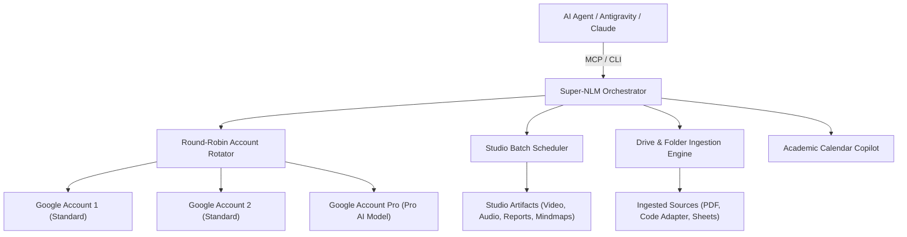

# Super-NLM Orchestrator & Fleet Management Skill

This skill provides comprehensive instructions for operating **Super-NLM**, a multi-account unified orchestrator and Model Context Protocol (MCP) server for Google NotebookLM.

---

## 1. Architectural Overview

Super-NLM enables parallel AI agents and developers to interact with $N$ Google NotebookLM accounts without hitting single-account query quotas or rate limits.



### Core Engine Capabilities
1. **Round-Robin Multi-Account Rotation**: Distributes notebook queries evenly across registered accounts.
2. **Two-Tiered Rate Limiting & Cooldown**:
   - **Burst Concurrency (429 / RPM)**: 120-second cooldown while token bucket refills.
   - **Daily Quota Exhaustion (RPD)**: Automatic cooldown until 00:00 UTC midnight.
   - **Automatic Fallback**: Pending queries immediately retry on the next available account.
3. **Studio Artifact Generation & Bulk Downloads**: Batch generation of video overviews, audio deep-dives, reports, mind maps, quizzes, and flashcards with deduplicated downloads.
4. **Hybrid Folder Mapping & Drive Sync**: Ingests local files or Google Drive web folders with automatic code adapters (`.ipynb` markdown extraction, `.py`, `.c`, `.m`, `.xlsx`).
5. **Academic Calendar & Course Copilot**: Auto-matches upcoming syllabus exams/deadlines to course codes (`CT653`, `CT704`, `EX751`, `EX752`, `ME708`, `EX725`).

---

## 2. Model Context Protocol (MCP) Reference

When `super-nlm` MCP server is active, use the following tools:

### Querying & Synthesis
- **`query_notebook(notebook_id, query, conversation_id?, source_ids?, timeout?, new_conversation?, use_pro?)`**:
  Query a notebook with automatic fleet rotation and optional Pro AI routing (`use_pro=True`).
- **`cross_query(notebook_ids[], query, synthesizer_profile_id?)`**:
  Query across multiple notebooks in parallel and synthesize unified insights using Pro AI.
- **`list_notebooks(search?, profile_id?, category?)`**:
  Search and list notebooks from local cache without consuming API quota (`category`: `'study'`, `'projects'`, or `'all'`).
- **`list_profiles()`**:
  List all connected Google profiles, their tiers (`pro` vs `standard`), and status.
- **`rotation_status()`**:
  Check fleet diagnostics, active query cooldowns, and round-robin counter.

### Studio Artifact Operations & Scheduling
- **`schedule_batch_creation(notebook_ids[], artifact_type, format_option?, style?, custom_prompt?, quantity?, difficulty?, preferred_profile_id?)`**:
  Queue background studio artifact creation across multiple notebooks.
  - `artifact_type`: `'video'`, `'audio'`, `'quiz'`, `'flashcards'`, `'mind_map'`, `'report'`, `'infographic'`, `'data_table'`, `'slide_deck'`.
- **`get_scheduled_queue(status_filter?)`**:
  Inspect queue items (`pending`, `running`, `completed`, `failed`).
- **`cancel_scheduled_job(job_id)`**:
  Cancel an active or queued generation task.

### Folder Mapping & Ingestion
- **`map_notebook_folder(notebook_id, target_path, folder_type?, display_name?, auto_sync?, recursive?)`**:
  Map a local filesystem path or Google Drive folder URL/ID to a notebook.
- **`get_folder_status(notebook_id)`**:
  Inspect mapped folder diffs (new, ingested, stale, unsupported) and 300-source capacity meter.
- **`sync_notebook_folder(notebook_id, action?, selected_files?)`**:
  Trigger sequential, rate-limited ingestion of new or stale sources.

### Calendar & Sharing
- **`get_agenda(days?)`**:
  Fetch upcoming schedule matched against registered course notebooks.
- **`batch_share_notebooks(notebook_ids[], target_profile_ids?, role?, auto_sync?)`**:
  Share notebooks across accounts with automatic editor permission caching.
- **`auto_share_study_courses(role?, auto_sync?)`**:
  Auto-detect all academic course notebooks and share across the fleet.

---

## 3. Direct CLI Workflows (`nlm`)

The `nlm` unified CLI can be executed directly for high-throughput batch operations:

### Studio Artifact Downloads
To download all artifacts from a notebook into a target folder without duplicates:
```powershell
nlm download all <notebook_id> --output-dir "C:\Path\To\Subject Folder" --skip-existing --interactive-format markdown
```

To download specific artifact types:
```powershell
# Download video overviews
nlm download video <notebook_id> --id <artifact_id> --output "video_title.mp4"

# Download reports/study guides
nlm download report <notebook_id> --id <artifact_id> --output "report_title.md"

# Download mind maps
nlm download mind-map <notebook_id> --id <artifact_id> --output "mindmap_title.json"
```

### Inspecting Studio Status
```powershell
nlm studio status <notebook_id> --json
```

---

## 4. Academic Course Mappings & Notebook IDs

For reference, the primary course notebooks in the ecosystem include:

| Course Code | Subject / Notebook Title | Key Notebook ID |
|---|---|---|
| **ME708** | ME708 - Organization and Management | `94cd4e14-802d-4231-b27d-6a4f4a2e6182` |
| **CT653** | Artificial Intelligence | `0e89a8...` |
| **CT704** | Digital Signal Analysis and Processing | `e52d46...` |
| **EX751** | Energy Management & Audit | *Fleet Managed* |
| **EX752** | RF & Microwave Engineering | `EX752...` |
| **EX725** | Embedded Systems Design | *Fleet Managed* |
| **Personal** | ⚙️ Aaradhya — Engineer's Personal Notebook | `95a79d26-2f87-42cd-8cb9-8361a1e56059` |
| **SPARK** | SPARK Research | `2c00f5a4-98dc-4783-96d1-3682fa3cb516` |
| **BiasAperture** | BiasAperture Study | `99bee3c6-07ed-4ff0-8ac8-0027b18ad06a` |

---

## 5. Ingestion Rules & Adapters

When preparing source files for ingestion via Super-NLM:
- **Jupyter Notebooks (`.ipynb`)**: Never ingested raw. Super-NLM's code adapter converts markdown cells and executable code blocks into clean markdown text before uploading.
- **Source Code (`.py`, `.c`, `.cpp`, `.m`, `.ts`, `.js`, `.json`, `.sql`)**: Wrapped in code fences with syntax headers.
- **Spreadsheets (`.xlsx`, `.xls`)**: Transformed into structured CSV / Markdown data tables.
- **Unsupported Executables / Archives (`.zip`, `.exe`, `.dll`, `.iso`)**: Automatically filtered out by the ingestion scanner.
- **Capacity Gates**: Ingestion verifies target capacity (Standard: 50 sources, Pro AI: 300 sources) before triggering batch uploads.
