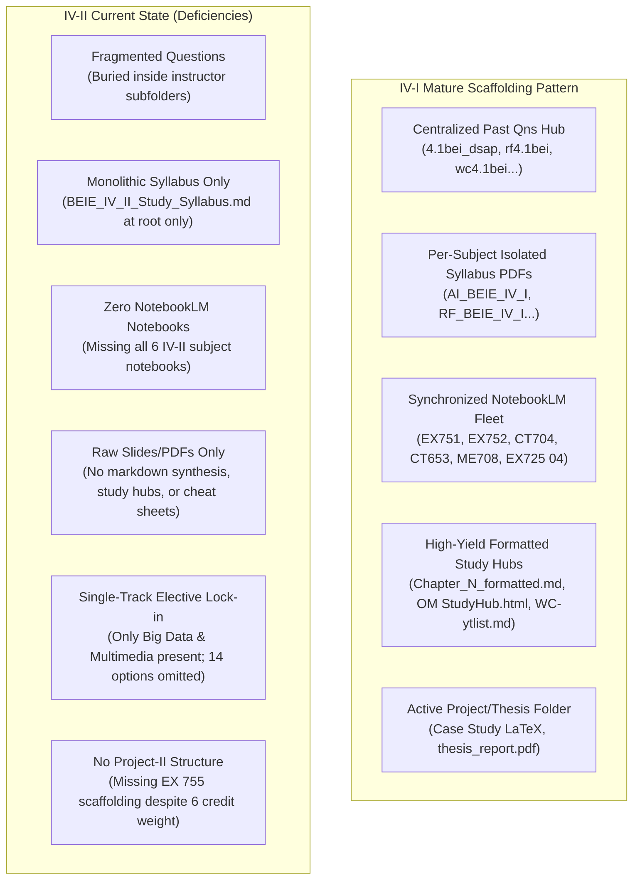

# Scout Survey: Electronics (NEW 075-079) IV-I vs IV-II Subject Structure & NotebookLM Grounding

**Mission:** Complete empirical survey of the subject note structures in `D:\Misc Aaradhya\Electronics (NEW 075-079)`, comparing the mature Year IV Part I (`[IV-I]`) scaffolding pattern with the incoming Year IV Part II (`[IV-II]`) repository, extracting all curriculum details and elective options, and identifying architectural gaps for NotebookLM fleet integration.
**Survey Date:** October 8, 2026  
**Agent:** Scout (`research` / `flash`)  
**Workspace:** `f:\Aaradhya-Dev-Tamrakar\super-nlm`

---

## 1. Executive Summary & Root Layout

Inspection of root directory `D:\Misc Aaradhya\Electronics (NEW 075-079)` reveals three primary nodes:
- `[IV-I]`: Mature semester note repository containing all 6 subjects, compiled question banks, lab reports, case studies, and study hubs.
- `[IV-II]`: Active incoming semester folder containing initial core lecture notes and slides, plus single-candidate folders for Electives II and III.
- `Curriculum_`: Master curriculum archive containing official IOE syllabi PDFs and full Markdown transcriptions (`BEI Syllabus\md\BEIE_IV_II_Study_Syllabus.md`).

---

## 2. Comprehensive Survey of `[IV-I]` Scaffolding

### 2.1 File & Directory Inventory

The `[IV-I]` directory contains 9 subdirectories and 5 root files:

#### Root Files in `[IV-I]`
- `BEI IV-I old questions_1.pdf` (11,736,183 bytes) – Consolidated past questions bundle.
- `BEIE IV_I Study Syllabus.pdf` (8,036,741 bytes) – Full semester master syllabus.
- `IV-I-Routine2083BhadraBE_2026_07_31_19_32_34.pdf` (848,504 bytes) – Semester exam/class routine.
- `thesis_report.pdf` (9,171,556 bytes) – Thesis/project reference report.
- `IV-I - Shortcut.lnk` (954 bytes) – Local navigation shortcut.

#### Subject Folders in `[IV-I]`

1. **`AI` (Artificial Intelligence - `CT 653`)**:
   - `Chapterwise/`: Seven standardized chapter notes (`Chapter 1. Introduction.pdf` through `Chapter 7. Applications of AI.pdf`).
   - `Class Slides/`: Presentation slides by instructors.
   - `Notes by BA Sir/`: Faculty-specific handwritten and digital notes.
   - `Notes by BJ Sir/`: Dr. Basanta Joshi's lecture notes and slides.
   - `Supporting notes/`: Reference materials and auxiliary cheat sheets.
   - `Extra Dose/`: Advanced topics and numerical solutions.
   - Root files: `Principles of Soft Computing-Wiley India (2019).pdf`, `AI_BEIE_IV_I Study Syllabus.pdf`, `IOE-Artificial-Intelligence-Lab-Code-Solutions-main.zip`.

2. **`DSAP` (Digital Signal Analysis and Processing - `CT 704`)**:
   - `Chapterwise/`: Seven standardized chapter files (`Chapter 1. Introduction To Signal And System .pdf` through `Chapter 7. Discrete Fourier transform.pdf`).
   - `GG sir/`: Lecture notes from Govinda Giri Sir.
   - `Notes by BB Sir/`: Notes from BB Sir.
   - `Notes by NAC Sir/`: Notes from N.A. Chaudhary Sir.
   - `Handwritten Notes/`: Digitized handwritten lecture notes.
   - `HCOE/`: Himalayan College of Engineering shared resources.
   - `Assignment/`: Problem sets and numerical problem solutions.
   - `Supporting/`: Formula sheets, filter design tables, transforms.
   - Root file: `DSAP_BEIE IV_I Study Syllabus.pdf`.

3. **`Elective I - Aeronautical Telecommunications` (`EX 725 04`)**:
   - `Old/`: Contains extracted markdown lecture notes:
     - `Aeronautical_Telecommunication_Syllabus.md`
     - `Chapter5_Surveillance_Radar.md`
     - `CNS_Introduction_in_Aero_Telecom.md`
     - `Exam_Notes_Radar_CNS_ATM.md`
     - `Introduction_to_Aviation.md`
     - `Introduction_to_Radar.md`
     - SSK lecture slide PDFs and DOCX notes (`SSK_Aeronautical Telecommunication reading Material full.pdf`, `SSK_Radar Introduction_Elective Class.pdf`, `SSK_RADAR kec.pdf`).
   - Root files: `Aeronautical Telecommunication Manual FF.doc`, `Aeronautical Telecommunication Manual FF.pdf`, `Aeronautical Telecommunications BEIE IV_I Study Syllabus.pdf`, `SSK_TU Aeronautical Telecommunication (Elective I ) Syllabus (1).doc`.

4. **`O&M` (Organization and Management - `ME 708`)**:
   - `Chapterwise/`: Empty directory (content elevated to root markdown files).
   - `Notes by AJ Sir/`: Slide decks (`CHAPTER 1.pptx` through `Chapter5.pptx`).
   - `SM sir/`: PDF chapter notes (`Chapter 1.pdf` through `Chapter 5.pdf`), `O&M Probable Questions for ADT 2.pdf`, `O&M.zip`.
   - `Additional/`: Reference chapters and textbook summaries.
   - Formatted Markdown Study Hubs:
     - `Chapter_1_formatted.md`, `Chapter_2_formatted.md`, `Chapter_3_Formatted.md`, `Chapter_4_formatted.md`, `Chapter_5_formatted.md`.
   - Interactive HTML Study App: `OM_ME708_StudyHub.html` and `OM_ME708_StudyHub (1).html`.
   - Root file: `O&M_BEIE IV_I Study Syllabus.pdf`.

5. **`RF & Microwave` (`EX 752`)**:
   - `Lectures by KK Sir/`: Chapter 1 to Chapter 8 lecture PDFs, amplifier & filter design slides.
   - `RF (Notes by SG Sir)`: Sandeep Sigdel Sir's PPTX slides (Ch 4, 6, 7, 8) and Pozar / Samuel Liao textbooks.
   - `RF Pulchowk/`: Pulchowk Campus lecture slides across chapters 1, 2, 3, 4, 5, 7, 8.
   - `Handwritten Notes/`: `RF _ Microwave Engg. (Sandeep Sigdel).pdf`.
   - `Loke ko note/`: Loki's handwritten summaries for Chapters 3 and 4.
   - `Lab Reports/`: Comprehensive student lab reports (Labs 1–3 docx & pdf by Ayan, RF 03).
   - `Additional/`: Pozar Microwave Engineering 4th Ed, Annapurna Das, RF guide, RF practice questions, Smith Charts.
   - Root file: `RF_BEIE IV_I Study Syllabus.pdf`.

6. **`Wireless Communication` (`EX 751`)**:
   - `Notes by AS Sir/`: Lectures and slides for Chapters 1 through 8, numerical problem sets, OFDM notes.
   - `Notes by SSD Sir/`: Chapters 1 to 8 PDFs covering Cellular Concepts, Propagation, Modulation, Equalization, Speech Coding, CDMA, GSM.
   - `Notes by SST Sir/`: Comprehensive lecture note set across chapters 1–8.
   - `WC SSD/`: Cleaned and structured chapter PDF files.
   - `Supporting/`: `Wireless solutions.pdf`.
   - Markdown Resource: `WC-ytlist.md` and `WC-ytlist.pdf` (curated YouTube video lecture syllabus mapping).
   - Root file: `Wireless_BEIE IV_I Study Syllabus.pdf`.

7. **`Past Qns` (Centralized Question Bank Hub)**:
   - `4.1bei_dsap.pdf` (5,821,104 bytes)
   - `aeronautical4.1.pdf` (4,127,695 bytes)
   - `BEI IV-I older questions.pdf` (11,736,183 bytes)
   - `BEI4AI4.1.pdf` (6,192,886 bytes)
   - `OM4.1.pdf` (4,391,233 bytes)
   - `RF-BEI IV-I older questions.pdf` (3,130,575 bytes)
   - `rf4.1bei.pdf` (6,646,278 bytes)
   - `wc4.1bei.pdf` (6,776,392 bytes)

8. **`Case Study`**:
   - Contains LaTeX sources and compiled outputs: `ONM_Casestudy_Fusemachines.tex`, `ONM_Casestudy_Fusemachines.pdf`, `.aux`, `.log`, `.toc`, `college_logo.jpg`.

9. **`Reference Books`**:
   - `ONM/`: Full reference texts for management and entrepreneurship.

---

### 2.2 NotebookLM Grounding & Cache Comparison (IV-I)

Audit of `f:\Aaradhya-Dev-Tamrakar\super-nlm\data\notebooks_cache.json` and `folder_mappings.json` demonstrates how IV-I subjects were systematically mirrored into the Super-NLM fleet:

| Subject | Course Code | NotebookLM Notebook Title | Notebook ID | Folder Mapping Binding |
| :--- | :--- | :--- | :--- | :--- |
| **Wireless Communications** | `EX 751` | `EX751 - Wireless Communications` | `c627a211-552e-496b-9ebb-42d22ac05a95` | Local folder: `C:\Users\Aaradhya\Downloads\EX751 Exam` (auto_sync: true, recursive: true) |
| **RF and Microwave Engineering** | `EX 752` | `EX752 - RF and Microwave Engineering` | `c3c8ecd4-2884-42a1-aa49-c4de168c1ec7` | Google Drive: `1y8W5U-WiwLPatVuWcK4nP7YBu9Uw9Q2Z` ("EX752 RF and Microwave Google Drive Folder") |
| *RF Satellite Hubs* | `EX 752` | `RF Assignments: Transmission Lines and Microwave Network Analysis` | `466483ae-f6bd-4bed-8ea3-e688340cc9ac` | Dedicated assignment analysis notebook |
| *RF Presentation Hub* | `EX 752` | `RF Presentation` | `a602321d-24dc-44d8-b3d3-eb6155b1c22e` | Presentation deck grounding notebook |
| **Digital Signal Analysis & Processing** | `CT 704` | `CT704 - Digital Signal Analysis and Processing` | `66c34505-a60d-4a24-98df-446d8df12a24` | Core theory & DSP algorithm grounding |
| **Organization and Management** | `ME 708` | `ME708 - Organization and Management` | `94cd4e14-802d-4231-b27d-6a4f4a2e6182` | Google Drive: `1abvrTk_I1NXh3gtGm1uVirfJnqTxCCFH` |
| *O&M Case Studies Satellite* | `ME 708` | `Principles and Methodology of Management Case Studies` | `6fbc24c9-0745-47f6-84e7-b50750e58378` | Case study grounding |
| **Artificial Intelligence** | `CT 653` | `CT653 - Artificial Intelligence` | `c4a8af46-115b-4dff-81bf-5a22db2fbc64` | Core AI curriculum notebook |
| *AI Exam Prep Satellite* | `CT 653` | `Principles and Applications of Artificial Intelligence Examination` | `fb89884c-dff2-4403-80ed-e04a65b22093` | Exam solution & question grounding |
| **Aeronautical Telecommunication** | `EX 725 04`| `EX725 04 - Aeronautical Telecommunication` | `56cdad30-13d3-4621-a0b7-8f841858476b` | Local folder: `C:\Users\Aaradhya\Downloads\EX725 04 Exam` (auto_sync: true, recursive: true) |

---

## 3. Comprehensive Survey of `[IV-II]` Current State

### 3.1 Root Directory Contents of `[IV-II]`
Path: `D:\Misc Aaradhya\Electronics (NEW 075-079)\[IV-II]`
- `BEIE IV_II Study Syllabus.pdf` (9,802,134 bytes) – Official IOE curriculum master PDF.
- `BEIE_IV_II_Study_Syllabus.md` (57,515 bytes) – High-fidelity Markdown transcription of the IV-II curriculum.
- 6 Subfolders: `Elective II`, `Elective III`, `Energy, Environment and Society`, `Engineering Professional Practice`, `Information System`, `Telecommunication`.

---

### 3.2 Subject-by-Subject Deep Dive

#### 1. `Telecommunication` (`EX 756` / `EX 703`)
Contains 4 major subfolders:
- `Notes [KEC]/`: Kathmandu Engineering College lecture series (Lectures 2 through 20):
  - `Telecommunication-lecture2-chapter1.pdf`
  - `Telecommunication-lecture3-Multiplexing.pdf`
  - `Telecommunication-lecture4-Digital-Switching.pdf` to `lecture6-Digital-Switching.pdf`
  - `Telecommunication-lecture7-Signalling.pdf` to `lecture9-Signalling.pdf`
  - `Telecommunication-lecture10-Telephone-Traffic.pdf` to `lecture15-Telephone-traffic.pdf`
  - `Telecommunication-lecture16-DataCommunication.pdf` to `lecture19-DataCommunication.pdf`
  - `Telecommunication-Lecture20-TransmissionMedium.pdf`
- `Notes by AKS Sir/`: Chapter-by-chapter granular breakdown:
  - `Telecommunication Chapter I A.pdf` & `I B.pdf` (Evolution, Switching classification)
  - `Telecommunication Chapter II A.pdf` & `II B.pdf` (Transmission Media & Hybrid)
  - `Telecommunication Chapter III.pdf` (Signal Multiplexing: FDM, TDM, E1)
  - `Telecommunication Chapter IV A.pdf` & `IV B.pdf` (Digital Switching: S, T, TST, STS)
  - `Telecommunication Chapter V A.pdf`, `V B.pdf`, `V C.pdf` (Signaling: CAS, CCS, SS7)
  - `Telecommunication Chapter VI A.pdf` & `VI B.pdf` (Telephone Traffic: GOS, Erlang, Queuing)
  - `Telecommunication Chapter VII.pdf` (Regulation: ITU, NTA)
  - `Telecommunication Chapter VIII A.pdf` (Data Communication)
  - `Telecommunication Chapter VIII B VOIP.pdf`
  - `Telecommunication Chapter VIII C ISDN.pdf`
  - `Telecommunication Chapter VIII D DSL.pdf`
- `Notes by Sir [PUL]/`: Pulchowk Campus lecture series:
  - `Chapter 1 Telecommunication Networks.pdf` through `Chapter 8 Data Coomunication.pdf`
  - `Additional/`: Rich library of reference texts and standards:
    - Bellamy, *Digital Telephony* (42.9 MB)
    - Tanenbaum, *Computer Networks 5th ed* (8.4 MB)
    - Freeman, *Telecommunication System Engineering* (8.3 MB)
    - `Telecom Act Upto date Eng.pdf`, `Rec.E.164_0.pdf`, `National Numbering Plan.pdf`, `TrafficEngineering.pdf`, `Telecommunication Old Question Collection.pdf`, `Question Bank.pdf`.
- `Slides/`: Slide decks for Chapters 1, 2, 3, 4, 5 (SS7), 6 (Traffic & Numericals), 8 (Most Asked Questions), plus focused mini-decks on S-switch, T-switch, ST/TST switch, SPC, TDM, and `telecom-assignment.pdf`.

#### 2. `Engineering Professional Practice` (`CE 752`)
Contains 5 subfolders:
- `Notes/`: Handout summaries (`Chapter 1_2 ST_HD.pdf`, `Chapter 3 and 4 Handsout.pdf`, `Chapter 5.pdf`, `Chapter 6.pdf`).
- `Notes by PO Sir/`: Er. Padam Oli's compiled resources:
  - `EPP Compiled Notes_IV_II by Er. Padam Oli.pdf`
  - `EPP cases.pdf` (Engineering case studies & ethics disputes)
  - Statutory acts: `NEC and Company ACT.pdf`, `कम्पनी-एेन-२०६३.pdf`, `नेपाल-इन्जिनियरिङ-परिषद-2.pdf`.
- `Recommended by Ritik/`: Two collections:
  - `1/`: Summaries for chapters 1, 2, 3, 4, 5, 6, plus `syllabus.pdf` and `Engineering Professional Practice.pdf`.
  - `2/`: Full presentation slides and past questions organized by chapter:
    - `ch 1/` (History of Engineering Practices pptx + pdf + old course questions)
    - `ch 2/` (Profession and Ethics pptx + pdf)
    - `ch 3/` (Professional Practices in Nepal A & B pptx + pdf)
    - `ch 4/` (Contract Management pptx + pdf + old course questions)
    - `ch 5/` (Regulatory Environment & IPR pptx + pdf)
    - `ch 6/` (Contemporary Issues pptx + pdf + case study questions and solutions)
    - Root of `2/`: `EPP Lecture note 2078 final.pdf`, `old qsn epp.pdf`, `The Nepal Engineering Council Act.pdf`.
- `Summarized/`: Quick review chapter summaries (`EPP notes.pdf`, `EPP Ch-1.pdf`, `chap 4.pdf`, `chap 5.pdf`, `chap 6.pdf`).
- `Extra Dose/`: `EPP Manual.pdf` (49.2 MB comprehensive reference manual).

#### 3. `Energy, Environment and Society` (`EX 758` / `EX 757`)
Contains 3 instructor folders:
- `By Bikal Adhikari/`:
  - `1.Lecture Slides/`: Complete deck covering:
    - `Chapter 1 Technology and Development.pdf`
    - `Chapter 2 Energy Basics.pdf`
    - `Chapter 3 Renewable Energy Sources.pdf`
    - `Chapter 4 Design of PV.pdf`
    - `Chapter 5 Application of Solar PV for Better Livelihood.pdf`
    - `Chapter 6 Energy Storage.pdf` & video `Chapter 6 What Is the Smart Grid-JwRTpWZReJk.webm`
    - `Chapter 7 Environmental Impacts of Energy.pdf`
  - `2.Old Questions/`: `Old Questions 2069 to 2079.pdf` (Ten-year exam solution & question collection).
  - `3.Books and Reference Materials/`: `EES EX 757 Lecture Notes Feb 21 2023.pdf`, `Training Manual for Engineers on Solar PV System.pdf`.
- `Notes by DR Sir/`:
  - `DR slides/`: Granular slide breakdown covering 3.1 Solar, 3.2 Hydro, 3.3 Wind, 3.4 Geothermal, 3.5 Bio Energy, 3.6 Hydrogen/Fuel Cells, Chapter 6.1–6.8 sizing documents (load calculations, array sizing, battery sizing, charge controller sizing, cable sizing, inverter sizing, DC converter sizing, installation practices), `EMISSION-HAZARDS.pptx`, and `SPS Basic Design for Lecture.pdf`.
  - Full notes: `EES All Chapter Notes.pdf`, `Lecture Notes On EES.pdf` (59.8 MB).
- `Notes by Sir/`:
  - Chapter PDFs: `Chapter 1.pdf`, `Chapter 2.pdf`, `Chpater 7 Environmental Impact of Energy Source.pdf`.
  - Focused notes: `Solar thermal-pv.pdf`, `Hydropower.pdf`, `wind.pdf`, `HYDROGEN - Introduction.pdf`, `fuel cell.pdf`, `Energy Storage.pdf`, `V2G.pdf`, `Emission Hazards.pdf`.
  - System sizing model: `ees solar design.xlsx` (spreadsheet calculator for PV systems).
  - Reference book: `.Fundamental of Renewable Energy Process.pdf` (9.4 MB by Aldo V. da Rosa).

#### 4. `Information System` (`CT 751`)
Contains:
- Root files:
  - `InformationSystemLectureSlides.pdf` (42.7 MB complete slide compendium)
  - `Insights on Information System.pdf` (59.9 MB in-depth reference text)
- `Slides/`: Clean slide presentations covering the entire 8-chapter syllabus:
  - `Chapter 1 Introduction to Information System.pdf`
  - `Chapter 2 Control, Audit and Security of Information system.pdf`
  - `Chapter 3 Enterprise Management Systems.pdf`
  - `Chapter 4 Decision support Intelligent systems.pdf`
  - `Chapter 5 Planning for information systems.pdf`
  - `Chapter 6 Implementation of Information systems.pdf`
  - `Chapter 7 Web based information system and navigation.pdf`
  - `Chapter 8 Scalable Emerging information System.pdf`
- `Notes by Mam/`:
  - `Chapter 2 Control, Audit and Security of Information System.pdf`
  - `CONTROL, AUDIT AND SECURITY OF INFORMATION SYSTEM.pptx`
  - `Enterprise Management Systems.pptx.pdf`

---

### 3.3 Electives State in `[IV-II]` (Undecided Electives Status)

#### Elective II Directory State
Currently, `D:\Misc Aaradhya\Electronics (NEW 075-079)\[IV-II]\Elective II` contains **ONLY ONE** folder:
- `Big Data Technologies` (`CT 765 07`)

Inside `Big Data Technologies`, there is an exceptionally rich multi-instructor repository:
1. `Big Data [Basanta Joshi]`
2. `Big Data [Bikal Adhikari]`
3. `Big Data [Dinesh Amatya]`
4. `Big Data [Gyaneshwar Bohora]`
5. `Big Data [Jagdish Rauniyar]`
6. `Big Data [KEC]`
7. `Big Data [Pulchowk]`
8. `Compiled by Sir`: Contains `Assignment Slides` and `Masters` lecture notes on GFS, HDFS, Hadoop, NoSQL, Bigtable, MongoDB, and Neo4j.
9. `Supplementary Resources`: Google File System papers (`gfs-sosp2003.pdf`), functional programming notes, and MapReduce lectures.

*Crucial Status Note:* While the repository has substantial materials for Big Data Technologies, the user has noted that **Elective II has not yet been officially finalized**. The other 7 elective options listed in the curriculum currently have zero folders or files in `Elective II`.

#### Elective III Directory State
Currently, `D:\Misc Aaradhya\Electronics (NEW 075-079)\[IV-II]\Elective III` contains **ONLY ONE** folder:
- `Multimedia System` (`CT 785 03`)

Inside `Multimedia System`, there are 3 subfolders and 1 past question file:
1. `Multimedia (SP Sir)`: Complete lecture set (Chapters 1 to 8: Introduction, Sound, Images/Graphics, Video/Animation, Data Compression, User Interfaces, Abstractions for Programming, Multimedia Applications).
2. `Slides`: Chapters 1 to 8 presentation slides from IOE notes.
3. `Extra Dose`: `Multimedia [Loki].pdf`, handwritten notes sets 1 and 2, and `Multimedia System [Manual].pdf`.
4. `OLD QUESTION.pdf`: Past exam question paper collection.

*Crucial Status Note:* Similarly, **Elective III has not yet been officially finalized**. The other 7 elective options in the curriculum have zero folders or files in `Elective III`.

---

## 4. Complete Curriculum & Syllabus Extraction (`BEIE_IV_II_Study_Syllabus.md`)

### 4.1 Teaching & Examination Schedule

| SN | Course Code | Course Title | L | T | P | Total Credits | Theory Assess | Theory Final (Hrs) | Theory Final (Marks) | Practical Assess | Practical Final | Total Marks |
|---|---|---|---|---|---|---|---|---|---|---|---|---|
| 1 | **EX 756** *(EX 703)* | Telecommunications | 3 | 1 | 1.5 | 5.5 | 20 | 3.0 | 80 | 25 | – | 125 |
| 2 | **CE 752** | Engineering Professional Practice | 2 | 0 | 0 | 2.0 | 10 | 1.5 | 40 | – | – | 50 |
| 3 | **EX 758** *(EX 701/757)* | Energy, Environment and Society | 2 | 0 | 0 | 2.0 | 10 | 1.5 | 40 | – | – | 50 |
| 4 | **CT 751** | Information Systems | 3 | 1 | 0 (1.5 lab) | 4.0 | 20 | 3.0 | 80 | – | – | 100 |
| 5 | **EX 765..** | Elective II | 3 | 1 | 1.5 | 5.5 | 20 | 3.0 | 80 | 25 | – | 125 |
| 6 | **EX 785..** | Elective III | 3 | 1 | 1.5 | 5.5 | 20 | 3.0 | 80 | 25 | – | 125 |
| 7 | **EX 755** | Project-II (Part B) | 0 | 0 | 6.0 | 6.0 | – | – | – | 50 | 50 | 100 |
| | | **Semester Total** | **16** | **4** | **10.5** | **30.5** | **100** | **15.0** | **400** | **125** | **50** | **675** |

---

### 4.2 Core Subjects Syllabus Breakdown

#### 1. Telecommunications (`EX 756` / `EX 703`)
- **Unit 1: Telecommunication Networks (4 hrs)** – Evolution, network topologies, switching system classification.
- **Unit 2: Transmission Media (4 hrs)** – Media characteristics, transmission lines, hybrid circuits, signal-to-noise ratio.
- **Unit 3: Signal Multiplexing (4 hrs)** – FDM, WDM, space division, TDM (North American T1 vs. European E1 carrier).
- **Unit 4: Digital Switching (8 hrs)** – Digital exchange architectures, Space switch (S), Time switch (T), combinations (ST, TS, STS, TST).
- **Unit 5: Signaling System (4 hrs)** – Channel Associated Signaling (CAS), Common Channel Signaling (CCS), ITU-T SS7 architecture.
- **Unit 6: Telephone Traffic (9 hrs)** – Traffic parameters (Erlang, CCS), Loss systems (Erlang B, GOS), Delay systems (Erlang C, Queuing M/M/1), routing schemes, national numbering & charging plans.
- **Unit 7: Telecommunication Regulation (2 hrs)** – ITU structure, Nepal Telecommunications Authority (NTA) legal frameworks.
- **Unit 8: Data Communication (10 hrs)** – Switching techniques, IP switching, softswitching, routing, ISDN (BRI/PRI), DSL technologies (ADSL, HDSL).

#### 2. Engineering Professional Practice (`CE 752`)
- **Unit 1: History of Engineering Practices (3 hrs)** – Society & technology evolution, Eastern vs Western traditions, history in Nepal.
- **Unit 2: Profession and Ethics (6 hrs)** – Definition, professional bodies, engineer-client-contractor triangle, Code of Ethics, moral dilemmas, liability and negligence.
- **Unit 3: Professional Practices in Nepal (3 hrs)** – Public sector (civil service/procurement), private sector, job profiles for fresh engineers.
- **Unit 4: Contract Management (6 hrs)** – Contract types, execution methods, tendering procedures (PPA/PPR), contract documents and breach.
- **Unit 5: Regulatory Environment (5 hrs)** – Nepal Engineering Council Act, Labor Act, Company Act, Copyright & Patent laws, building bylaws.
- **Unit 6: Contemporary Issues in Engineering (3 hrs)** – Globalization, Public-Private Partnerships (PPP), safety & risk assessment, environmental conflicts, dispute resolution (mediation/arbitration).
- **Unit 7: Case Studies Based on Engineering Practices (4 hrs)** – Analysis of ethical dilemmas, liability, and dispute arbitration in real engineering scenarios.

#### 3. Energy, Environment and Society (`EX 758`, revised Mangsir 2076)
- **Unit 1: Technology and Development (2 hrs)** – Appropriate technology, socio-economic transformation, technology transfer.
- **Unit 2: Energy Basics (4 hrs)** – Energy forms, conservation & efficiency, national energy security, Maslow's hierarchy & Human Development Index (HDI), conventional sources (fossil, nuclear).
- **Unit 3: Renewable Energy Sources (6 hrs)** – Solar radiation & PV technology, hydropower classifications & turbines, wind resource calculations & turbines, hydrogen energy & PEM fuel cells.
- **Unit 4: Application of RE Sources to Power Electronic Equipment (8 hrs)** – Design of off-grid solar PV power systems for institutions, BTS telecom stations, and earth stations (load calculation, battery, inverter, array sizing).
- **Unit 5: Environmentally Friendly Application of Solar Electricity for Better Livelihood (3 hrs)** – Solar water pumping systems for remote areas, solar induction cooking and clean kitchen benefits.
- **Unit 6: Energy Storage (3 hrs)** – Storage mechanisms, battery chemistry (lead-acid vs lithium-ion), EV / PHEV integration, Smart Grid, Vehicle-to-Grid (V2G / G2V), supercapacitors.
- **Unit 7: Environmental Impact of Energy Sources (4 hrs)** – Emission hazards, Global Warming Potential (GWP), Keith Smith Chart, battery chemical hazards, nuclear waste disposal.

#### 4. Information Systems (`CT 751`)
- **Unit 1: Information System (3 hrs)** – Classification, functional areas, IS architecture, system quality, resource management, Balanced Scorecard.
- **Unit 2: Control, Audit and Security of IS (5 hrs)** – Controls, audit procedures, multi-layered security (consumer & enterprise), SSL/TLS, remote access authentication, e-commerce security.
- **Unit 3: Enterprise Management Systems (4 hrs)** – EMS, ERP, SCM, CRM, process alignment, enterprise integration frameworks.
- **Unit 4: Decision Support and Intelligent Systems (7 hrs)** – Operations research models, GDSS, EIS, Knowledge-Based Expert Systems, AI/neural networks, Data Warehousing, OLAP, OLTP, fraud detection.
- **Unit 5: Planning for IS (3 hrs)** – Strategic, tactical, and operational IS roadmaps.
- **Unit 6: Implementation of Information Systems (7 hrs)** – Change management, critical success factors, next-gen Balanced Scorecards.
- **Unit 7: Web-Based Information System and Navigation (8 hrs)** – Web graph structure, PageRank/HITS link analysis, web search algorithms, web usage mining, collaborative filtering, recommender systems.
- **Unit 8: Scalable and Emerging Information System Techniques (8 hrs)** – Big data techniques, Cloud computing models, MapReduce fundamentals, Hadoop ecosystem, cloud-based IR.

#### 5. Project-II (Part B) (`EX 755`)
- **Credits:** 6.0 | **Practical Marks:** 100 (50 internal assessment, 50 external defense).
- Capstone engineering hardware/software product development, integration, testing, documentation, and thesis presentation.

---

### 4.3 Complete Elective II Catalog (8 Options)

Every Elective II course carries: **3 Lectures, 1 Tutorial, 1.5 Practical (3/2) = 5.5 Credits | 125 Marks (20 Theory Int, 80 Theory Final, 25 Practical Int)**.

| Code | Subject Title | Curriculum Outline & Focus | Status in `[IV-II]` |
| :--- | :--- | :--- | :--- |
| **`CT 765 07`** | **Big Data Technologies** | GFS, MapReduce, NoSQL (HBase, Cassandra, MongoDB), Lucene/Elasticsearch indexing, Hadoop ecosystem, cluster setup. | **Files Present** (`Elective II\Big Data Technologies` with 9 subfolders) |
| **`EX 765 01`** | **Optical Fiber Communication System** | Dielectric waveguides, Maxwell equations, step/graded index fibers, attenuation, dispersion, lasers, PIN/APD detectors, optical couplers, EDFA amplifiers, optical LANs. | No files currently |
| **`EX 765 03`** | **Broadcast Engineering** | Audio/studio acoustics, TV scanning & color standards (PAL/NTSC), AM/FM transmitters, TV/CATV broadcast distribution, satellite GPS navigation. | No files currently |
| **`CT 765 02`** | **Agile Software Development** | Agile manifesto, user stories, planning game, velocity, TDD (unit test, mock objects, refactoring), Extreme Programming (XP), pair programming. | No files currently |
| **`CT 765 03`** | **Networking with IPv6** | IPv6 header & addressing, ICMPv6, neighbor discovery, IPsec QoS, RIPng / OSPFv3 / PIM-SM, dual-stack/tunneling transitions, DNS AAAA records. | No files currently |
| **`CT 765 04`** | **Advanced Computer Architecture** | Von Neumann computational models, thread/instruction level parallelism, deep pipelining, superscalar issue & shelving, branch prediction, MIMD/NUMA/COMA. | No files currently |
| **`CT 765 05`** | **Information Systems** | Elective variant of IS (content mirrors core CT 751 closely; generally taken by non-electronics streams). | No files currently |
| **`EX 765 06`** | **Database Management Systems** | E-R modeling, relational algebra, SQL, normal forms (1NF–DKNF), query optimization, B+ trees, ACID transactions, concurrency locking, crash recovery. | No files currently |

---

### 4.4 Complete Elective III Catalog (8 Options)

Every Elective III course carries: **3 Lectures, 1 Tutorial, 1.5 Practical (3/2) = 5.5 Credits | 125 Marks (20 Theory Int, 80 Theory Final, 25 Practical Int)**.

| Code | Subject Title | Curriculum Outline & Focus | Status in `[IV-II]` |
| :--- | :--- | :--- | :--- |
| **`CT 785 03`** | **Multimedia System** | Audio/speech generation, image/graphics formats, video representation, lossy/lossless data compression (JPEG, MPEG), UI design, multimedia toolkits. | **Files Present** (`Elective III\Multimedia System` with slides, notes, past questions) |
| **`EE 785 07`** | **Power Electronics** | Power semiconductor switches (SCR, MOSFET, IGBT), controlled rectifiers (1-phase & 3-phase), DC/AC choppers, PWM inverters, motor speed drives, UPS/SMPS. | No files currently |
| **`CT 785 07`** | **Geographical Information System (GIS)** | Spatial data modeling (vector, raster, topology), coordinate systems & projections, GPS/remote sensing data integration, spatial analysis/buffering, ArcGIS, OpenGIS. | No files currently |
| **`CT 785 01`** | **Remote Sensing** | Physical EM radiation principles, radar backscattering, passive (optical/microwave) & active (radar/lidar) sensors, satellite image classification, environmental monitoring. | No files currently |
| **`CT 785 04`** | **Enterprise Application Design & Development** | Multi-tier & MVC architectures, GoF design patterns, JDBC/connection pools, SOA & web services, Java EE (servlets, JSP, EJB 3.0), AJAX & Rich Internet Apps. | No files currently |
| **`CT 785 05`** | **XML: Foundations, Techniques & Applications** | XML syntax, DTD, XML Schema, XSLT, XPath, XQuery, native XML databases, RDF, OWL, Semantic Web, SOAP, WSDL, UDDI, XBRL. | No files currently |
| **`CT 785 08`** | **Speech Processing** | Speech production models, acoustic phonetics, waveform quantization (DPCM), short-time energy, zero-crossing rate, pitch autocorrelation, short-time Fourier & LPC. | No files currently |
| **`CT 785 06`** | **Artificial Intelligence** | Search (DFS, BFS, A*, minimax), knowledge representation (FOPL), machine learning, neural networks, expert systems, NLP (Identical to IV-I CT 653). | No files currently (Redundant for BEI) |

---

## 5. Architectural Gap Analysis: IV-I Scaffolding vs. IV-II Current State

Comparing the two directories side-by-side reveals 6 major architectural deficiencies in `[IV-II]`:



### Gap 1: Centralized Past Examination Question Bank
- **IV-I:** Had a dedicated top-level `Past Qns` folder with official TU/IOE board question papers isolated per subject code.
- **IV-II:** Old questions are fragmented and buried:
  - EES has `By Bikal Adhikari\2.Old Questions\Old Questions 2069 to 2079.pdf`.
  - EPP has `Recommended by Ritik\2\old qsn epp.pdf` and chapter exam snippets.
  - Telecommunication has `Notes by Sir [PUL]\Additional\Telecommunication Old Question Collection.pdf`.
  - Multimedia has `OLD QUESTION.pdf`.
  - Information System and Big Data have no distinct past question collections surfaced.

### Gap 2: Modular Subject-Level Syllabus Extracts
- **IV-I:** Every folder possessed a dedicated PDF (`Wireless_BEIE IV_I Study Syllabus.pdf`, `RF_BEIE IV_I Study Syllabus.pdf`, etc.) enabling instant single-subject context feeding.
- **IV-II:** Only the monolithic 908-line markdown and 9.8MB PDF exist at the root. Individual folders lack their isolated, scoped syllabus markdown files.

### Gap 3: Undecided Elective Modularity
- **IV-I:** Elective I was settled on Aeronautical Telecommunication (`EX 725 04`), but retained old syllabus notes modularly.
- **IV-II:** Currently has hardcoded folders `Elective II\Big Data Technologies` and `Elective III\Multimedia System`. Because electives are not finalized, if the college or student chooses e.g. **Optical Fiber Communication System (`EX 765 01`)** or **Broadcast Engineering (`EX 765 03`)** for Elective II, or **Power Electronics (`EE 785 07`)** or **GIS (`CT 785 07`)** for Elective III, the structure has no provision or scaffolding for them.

### Gap 4: Grounding in NotebookLM Fleet (`super-nlm`)
- **IV-I:** Completely indexed in `notebooks_cache.json` and linked to disk folders via `folder_mappings.json`.
- **IV-II:** Completely absent from `notebooks_cache.json`. Not a single notebook exists for `EX756`, `CE752`, `EX758`, `CT751`, `EX765`, or `EX785`.

### Gap 5: High-Agency Study Hubs & Synthesized Markdown
- **IV-I:** Contained production-grade markdown chapter notes (`Chapter_1_formatted.md`), interactive HTML applications (`OM_ME708_StudyHub.html`), and external media indices (`WC-ytlist.md`).
- **IV-II:** Currently 100% binary slides (PowerPoint/PDF). No synthesized markdown chapter hubs, formula cheat sheets, or interactive study guides exist yet.

### Gap 6: Project-II (`EX 755`) Capstone Folder
- **IV-I:** Handled `Case Study` with full LaTeX compilation and final thesis templates.
- **IV-II:** Project-II (Part B) carries **6 credits and 100 marks** (the single highest credit block in the semester), but has no folder in `[IV-II]`.

---

## 6. Target Scaffolding Recommendations for Modular Rollout

To bring `[IV-II]` up to the maturity of `[IV-I]` while strictly accommodating **undecided electives**, the following scaffold structure is recommended:

```
D:\Misc Aaradhya\Electronics (NEW 075-079)\[IV-II]\
├── BEIE IV_II Study Syllabus.pdf
├── BEIE_IV_II_Study_Syllabus.md
├── Past Qns\
│   ├── EX756_Telecommunications_Past_Qns.pdf
│   ├── CE752_Engineering_Professional_Practice_Past_Qns.pdf
│   ├── EX758_Energy_Environment_Society_Past_Qns.pdf
│   ├── CT751_Information_Systems_Past_Qns.pdf
│   ├── CT765_07_Big_Data_Past_Qns.pdf
│   └── CT785_03_Multimedia_System_Past_Qns.pdf
├── Telecommunication\
│   ├── Telecommunication_Syllabus.md
│   ├── Chapterwise\
│   ├── Notes [KEC]\
│   ├── Notes by AKS Sir\
│   ├── Notes by Sir [PUL]\
│   └── Slides\
├── Engineering Professional Practice\
│   ├── EPP_Syllabus.md
│   ├── Notes by PO Sir\
│   ├── Recommended by Ritik\
│   ├── Summarized\
│   └── Extra Dose\
├── Energy, Environment and Society\
│   ├── EES_Syllabus.md
│   ├── By Bikal Adhikari\
│   ├── Notes by DR Sir\
│   └── Notes by Sir\
├── Information System\
│   ├── Information_System_Syllabus.md
│   ├── Notes by Mam\
│   └── Slides\
├── Elective II\
│   ├── _Elective_II_Options_Catalog.md  <-- Modular directory index with all 8 syllabi
│   ├── Big Data Technologies\           <-- Currently populated (CT 765 07)
│   ├── Optical Fiber Communication\     <-- Scaffolding ready if chosen (EX 765 01)
│   └── Broadcast Engineering\           <-- Scaffolding ready if chosen (EX 765 03)
├── Elective III\
│   ├── _Elective_III_Options_Catalog.md <-- Modular directory index with all 8 syllabi
│   ├── Multimedia System\               <-- Currently populated (CT 785 03)
│   ├── Power Electronics\               <-- Scaffolding ready if chosen (EE 785 07)
│   └── Geographical Information System\ <-- Scaffolding ready if chosen (CT 785 07)
└── Project-II\                          <-- EX 755 Capstone scaffolding
    ├── Proposal\
    ├── Documentation\
    └── Defense Slides\
```

### Proposed Super-NLM Fleet Notebook Plan

When batch creating or syncing NotebookLM notebooks for IV-II, register them with standard course-code prefixes:
1. `EX756 - Telecommunications` (Core)
2. `CE752 - Engineering Professional Practice` (Core)
3. `EX758 - Energy, Environment and Society` (Core)
4. `CT751 - Information Systems` (Core)
5. `EX755 - Project-II (Part B)` (Core Capstone)
6. **Elective II Candidate**: `CT765 07 - Big Data Technologies` (or designated option)
7. **Elective III Candidate**: `CT785 03 - Multimedia System` (or designated option)
